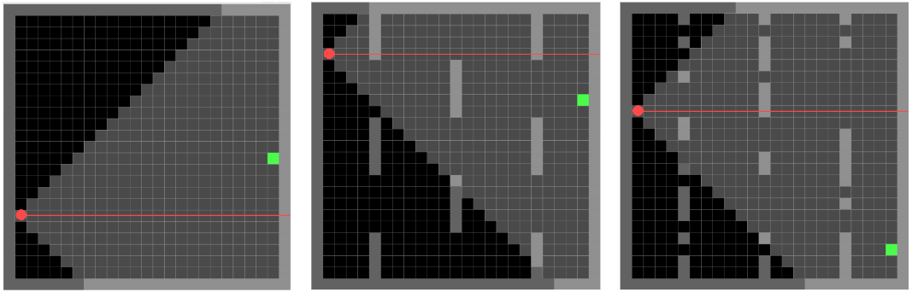

# Reinforcement Learning with MiniGrid


<span style="font-size:smaller;"><em>ShootingMiniGrid (no walls / static walls / random walls)
</em></span>

## Description
This project explores reinforcement learning in 2D environments, using variations of the [MiniGrid](https://minigrid.farama.org/) environment. It focuses on two types: those provided by MiniGrid and a custom variant called ShootingMiniGrid, which introduces shooting mechanics.

## Project Structure
The project consists of several Python scripts, each corresponding to different aspects of reinforcement learning and environment simulation:

### A) Basic LunarLander Environment from [Gymnasium](https://gymnasium.farama.org/environments/box2d/lunar_lander/)
- `lunar_learn.py`: Script for training an agent in the Lunar Lander environment.
- `lunar_load.py`: Load and render a trained model in Lunar Lander.

### B) [MiniGrid-Empty](https://minigrid.farama.org/environments/minigrid/EmptyEnv/) Environment
- `minigrid_empty_learn.py`: Training an agent in the MiniGrid-Empty environment.
- `minigrid_empty_load.py`: Load and render a trained agent in the MiniGrid-Empty environment.

### C) Custom Basic Environment
- `custom_env.py`: Definition of a custom MiniGrid environment.
- `custom_env_learn.py`: Training an agent in the custom environment.
- `custom_env_load.py`: Load and show a trained agent in the custom environment.

### D) ShootingMiniGrid: MiniGrid Environment with Shooting Functionality
- `make_shooting_minigrid_env.py`: Function to instantiate a ShootingMiniGrid environment.
- `manual_control_shooting.py`: Manual control of the agent in ShootingMiniGrid.
- `shooting_minigrid_env.py` / `v1` / `v2` / `v3`: Versions of the ShootingMiniGrid environment.
- `shooting_minigrid_learn.py` / `v3`: Training the agent in ShootingMiniGrid.
- `shooting_minigrid_load.py`: Load and render an agent in ShootingMiniGrid.

## How to Use
Developed with Python 3.11. To run the scripts, it is necessary to have installed libraries such as Gymnasium, MiniGrid, Stable-Baselines3, among others. Dependencies can be installed using:

```bash
pip install -r requirements.txt
